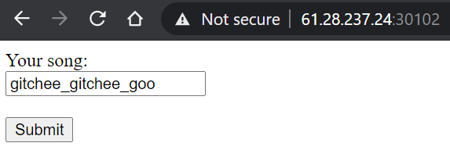
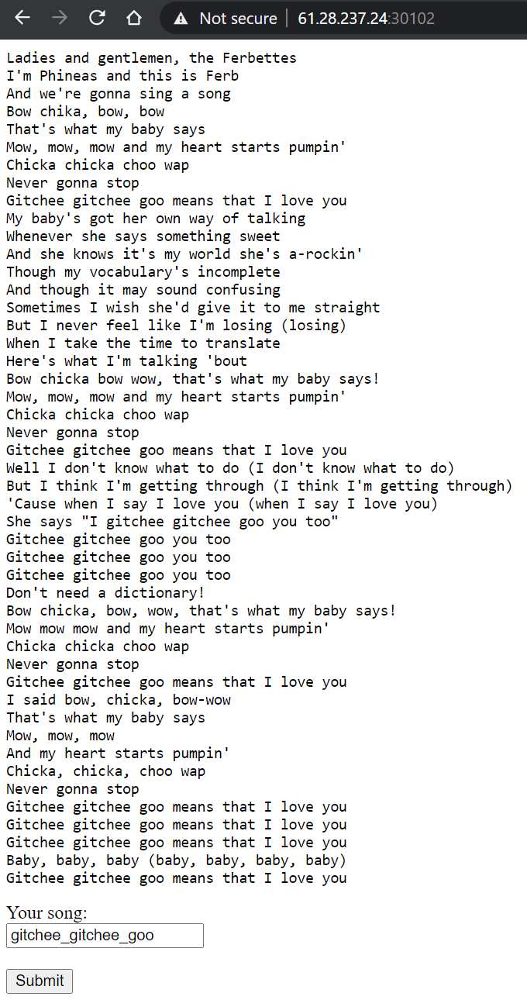
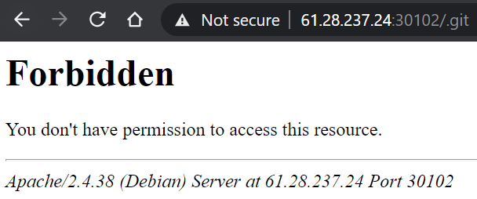
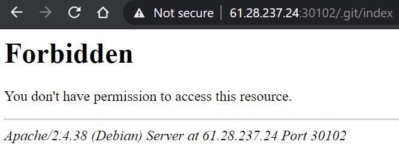
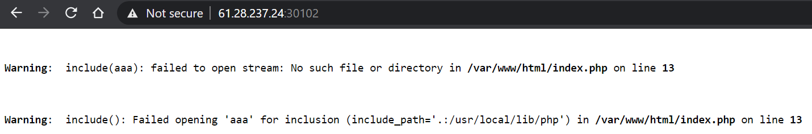
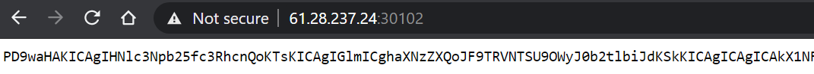

## GITchee-gitchee-goo (200 points)

#### Solved by Fluoxetine

```
Bow chika, bow, bow
That's what my baby says...

61.28.237.24 30102

authors: d0r4, Em0n
```








Now just checkout each commit until we see the flag:

```shell
git checkout HEAD~1
```


**Flag:** `HCMUS-CTF{mOt1vaT3d_by_0ld_m3Mory}`
