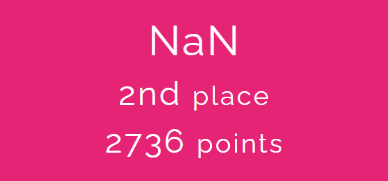

# HCMUS-CTF 2021 Qualification Round Writeup

  

This is my very first CTF competition. My team (NaN) solved all challenges after 26 hours 33 minutes and took the second place.

Team members:

- naul (Pham Kha Luan)
- nhanlun (Nguyen Thanh Nhan)
- hieplpvip (Le Bao Hiep)
- Fluoxetine (Tran Quoc Thang)

### Web

- [Nothingness](./Nothingness)
- [EasyLogin](./EasyLogin)
- [SimpleCalculator](./SimpleCalculator)
- [GITchee-gitchee-goo](./GITchee-gitchee-goo)

### Reversing

- [Faded](./Faded)
- [RealMalware1](./RealMalware1)
- [bhide](./bhide)
- [AndroidRev](./AndroidRev)
- [mixed_vm](./mixed_vm)
- [WeirdProtocol](./WeirdProtocol)

### Pwn

- [mybirthday](./mybirthday)
- [bank1](./bank1)
- [bank2](./bank2)
- [bank3](./bank3)
- [bank4](./bank4)
- [bank5](./bank5)
- [bank6](./bank6)
- [SecretWeapon](./SecretWeapon)

### Forensics

- [NiceEars](./NiceEars)
- [metadata](./metadata)
- [SaveMe](./SaveMe)
- [Maquerade](./Maquerade)
- [Memory](./Memory)
- [TestYourCmd](./TestYourCmd)

### Cryptography

- [SanityCheck](./SanityCheck)
- [SingleByte](./SingleByte)
- [TheChosenOne](./TheChosenOne)
- [CrackMe](./CrackMe)
- [Permutation](./Permutation)
- [DESX](./DESX)
- [RSB](./RSB)

### Misc

- [Dodge](./Dodge)
- [StrangerThing](./StrangerThing)
- [EscapeMe](./EscapeMe)
