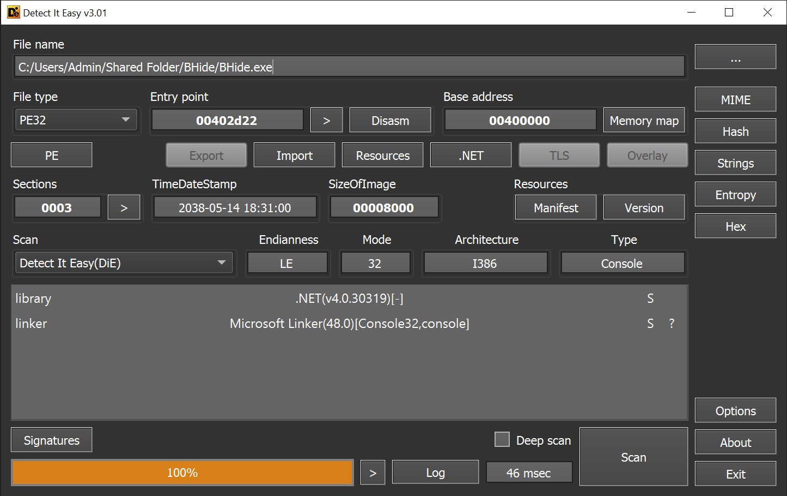
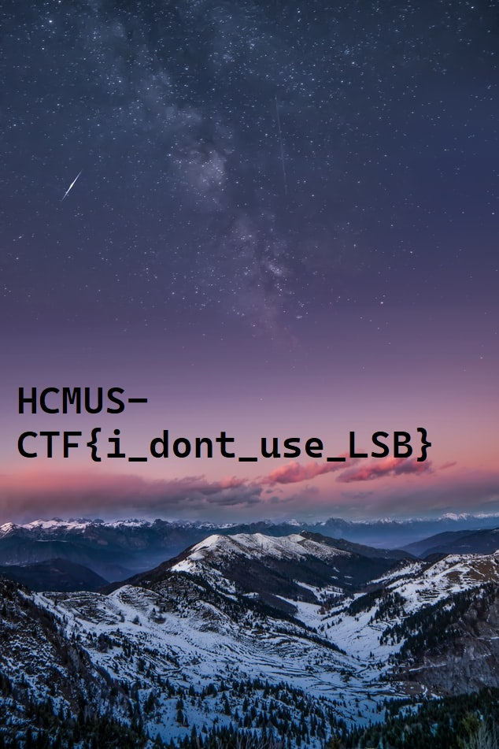

## bhide (100 points)

#### Solved by hieplpvip

```
I hide a secret in the picture. Can you find it?

https://mega.nz/file/69hymQRQ#CxS_ez76pNl3PcCqHrawuLS0jIh_RHnY7TstixTY7jE

author: xikhud
```



It's a .NET application, so we use dnSpy to decompile it.

```cs
using System;
using System.Drawing;
using System.Drawing.Imaging;
using System.IO;
using System.Runtime.InteropServices;

namespace BHide
{
	// Token: 0x02000002 RID: 2
	internal class Program
	{
		// Token: 0x06000001 RID: 1 RVA: 0x00002050 File Offset: 0x00000250
		private static long gfs(string zz)
		{
			return new FileInfo(zz).Length;
		}

		// Token: 0x06000002 RID: 2 RVA: 0x0000205D File Offset: 0x0000025D
		private static Bitmap gbfp(string zz2)
		{
			return new Bitmap(zz2);
		}

		// Token: 0x06000003 RID: 3 RVA: 0x00002068 File Offset: 0x00000268
		private static byte[] gbfb(Bitmap zsh)
		{
			Rectangle rect = new Rectangle(0, 0, zsh.Width, zsh.Height);
			BitmapData bitmapData = zsh.LockBits(rect, ImageLockMode.ReadOnly, PixelFormat.Format24bppRgb);
			int num = bitmapData.Stride * bitmapData.Height;
			byte[] array = new byte[num];
			Marshal.Copy(bitmapData.Scan0, array, 0, num);
			zsh.UnlockBits(bitmapData);
			return array;
		}

		// Token: 0x06000004 RID: 4 RVA: 0x000020C4 File Offset: 0x000002C4
		private static byte asdf(byte n, int ll, int vv)
		{
			byte result;
			if (vv == 0)
			{
				result = (n & ~(byte)(1 << (int)((byte)ll)));
			}
			else
			{
				result = (byte)(1 << (int)((byte)ll) | (int)n);
			}
			return result;
		}

		// Token: 0x06000005 RID: 5 RVA: 0x000020F1 File Offset: 0x000002F1
		private static byte[] rmrf(string zas)
		{
			return File.ReadAllBytes(zas);
		}

		// Token: 0x06000006 RID: 6 RVA: 0x000020F9 File Offset: 0x000002F9
		private static bool cs(long sz1, long sz2)
		{
			return sz1 * 8L <= sz2;
		}

		// Token: 0x06000007 RID: 7 RVA: 0x00002108 File Offset: 0x00000308
		private static void h(byte[] sr, byte[] bb)
		{
			int num = 0;
			int num2 = 0;
			for (int i = 0; i < sr.Length; i++)
			{
				for (int j = 7; j >= 0; j--)
				{
					int vv = sr[i] >> j & 1;
					byte b = Program.asdf(bb[num2], num, vv);
					bb[num2++] = b;
					num ^= 1;
				}
			}
		}

		// Token: 0x06000008 RID: 8 RVA: 0x0000215C File Offset: 0x0000035C
		private static void rb(Bitmap zzmb, byte[] bbb)
		{
			Rectangle rect = new Rectangle(0, 0, zzmb.Width, zzmb.Height);
			BitmapData bitmapData = zzmb.LockBits(rect, ImageLockMode.WriteOnly, PixelFormat.Format24bppRgb);
			IntPtr scan = bitmapData.Scan0;
			Marshal.Copy(bbb, 0, scan, bbb.Length);
			zzmb.UnlockBits(bitmapData);
		}

		// Token: 0x06000009 RID: 9 RVA: 0x000021A8 File Offset: 0x000003A8
		private static void Main(string[] args)
		{
			if (args.Length != 2)
			{
				Console.WriteLine("[+] Usage: bhide.exe <file1> <bitmap_file>");
				return;
			}
			string text = args[0];
			string text2 = args[1];
			if (!File.Exists(text) || !File.Exists(text2))
			{
				Console.WriteLine("[+] One of two files doesn't exist");
				return;
			}
			Bitmap bitmap = Program.gbfp(text2);
			byte[] array = Program.gbfb(bitmap);
			if (!Program.cs(Program.gfs(text), (long)array.Length))
			{
				Console.WriteLine("[+] Invalid size");
				return;
			}
			Program.h(Program.rmrf(text), array);
			Program.rb(bitmap, array);
			bitmap.Save("bhide-" + text2);
			Console.WriteLine("[+] Done");
		}
	}
}
```

In summary, `Main` does the following:

- Read bitmap data of `bitmap_file`:

```cs
Bitmap bitmap = Program.gbfp(text2);
byte[] array = Program.gbfb(bitmap);
```

- Check if `bitmap_file` is big enough to hide `file`:

```cs
if (!Program.cs(Program.gfs(text), (long)array.Length))
{
	Console.WriteLine("[+] Invalid size");
	return;
}
```

- Hide `file` in `bitmap_file`:

```cs
Program.h(Program.rmrf(text), array);
Program.rb(bitmap, array);
bitmap.Save("bhide-" + text2);
```

Let's see what `h` does:

```cs
private static void h(byte[] sr, byte[] bb)
{
	int num = 0;
	int num2 = 0;
	for (int i = 0; i < sr.Length; i++)
	{
		for (int j = 7; j >= 0; j--)
		{
			int vv = sr[i] >> j & 1;
			byte b = Program.asdf(bb[num2], num, vv);
			bb[num2++] = b;
			num ^= 1;
		}
	}
}
```

Each byte of `file` is stored in 8 bytes of `bitmap_file`, 1 byte for each bit.

```cs
private static byte asdf(byte n, int ll, int vv)
{
	byte result;
	if (vv == 0)
	{
		result = (n & ~(byte)(1 << (int)((byte)ll)));
	}
	else
	{
		result = (byte)(1 << (int)((byte)ll) | (int)n);
	}
	return result;
}
```

Decryption is pretty straightforward. We just need to figure out how to decrypt `asdf`. To save time, I decided to brute force `n` and `vv`, given `ll` and return value of `asdf`.

```cs
using System;
using System.IO;
using System.Drawing;
using System.Drawing.Imaging;
using System.Runtime.InteropServices;

namespace BShow {
	class Program {
		static byte[] read_bitmap(Bitmap bmp)
		{
			Rectangle rect = new Rectangle(0, 0, bmp.Width, bmp.Height);
			BitmapData bitmapdata = bmp.LockBits(rect, ImageLockMode.ReadOnly, PixelFormat.Format24bppRgb);
			int length = bitmapdata.Stride * bitmapdata.Height;
			byte[] destination = new byte[length];
			Marshal.Copy(bitmapdata.Scan0, destination, 0, length);
			bmp.UnlockBits(bitmapdata);
			return destination;
		}

		static byte enc_byte(byte n, int ll, int vv)
		{
			return (vv != 0) ? ((byte)((1 << (((byte)ll) & 0x1f)) | n)) : ((byte)(n & ~((byte)(1 << (((byte)ll) & 0x1f)))));
		}

		static int dec_byte(byte n, int ll)
		{
			for (int vv = 0; vv < 2; ++vv)
			{
				for (byte org = 0;; ++org)
				{
					if (enc_byte(org, ll, vv) == n) return vv;
					if (org == byte.MaxValue) break;
				}
			}
			return 0;
		}

		static byte[] dec_file(byte[] bb)
		{
			byte[] tmp = new byte[bb.Length / 8];
			int ll = 0, index = 0, done = 0;
			for (int i = 0; i < tmp.Length; ++i)
			{
				bool ok = true;
				tmp[i] = 0;
				for (int j = 7; j >= 0; --j) {
					int vv = dec_byte(bb[index++], ll);
					if (vv == -1)
					{
						ok = false;
						break;
					}
					tmp[i] |= (byte)((byte)vv << j);
					ll ^= 1;
				}
				if (!ok) break;
				++done;
			}

			byte[] dec = new byte[done];
			for (int i = 0; i < done; ++i)
			{
				dec[i] = tmp[i];
			}
			return dec;
		}

		static void Main(string[] args)
		{
			string path = "bhide-sample.bmp";
			if (!File.Exists(path))
			{
				Console.WriteLine("[+] Files doesn't exist");
			}

			Bitmap bmp = new Bitmap(path);
			byte[] bb = read_bitmap(bmp);
			byte[] dec = dec_file(bb);
			File.WriteAllBytes("bhide-sample.dec", dec);
		}
	}
}
```

Using Detect It Easy, we know `bhide-sample.dec` is a JPEG image file.



**Flag:** `HCMUS-CTF{i_dont_use_LSB}`
