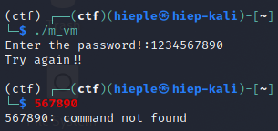
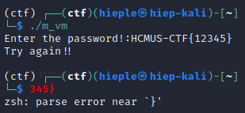
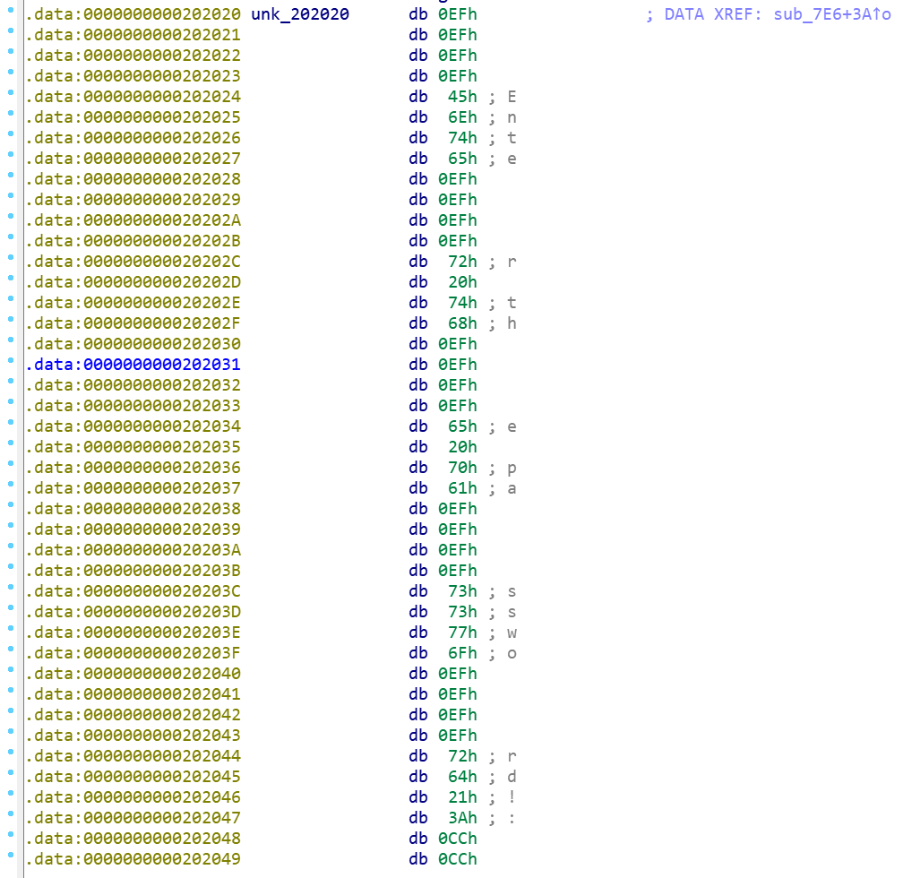
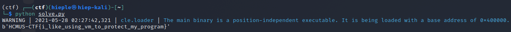

## mixed_vm (200 points)

#### Solved by hieplpvip

```
I just create a new VM. Can you find the secret inside it?

https://drive.google.com/drive/folders/1vCpYheehEwsTK3PqSicY0Lx1JyVtp_GK?usp=sharing

author: xikhud
```

Let's run it:



Interesting! `1234567890` were cut into `1234` and `567890`. Perhaps it checks the password by block of 4.

Let's try enter some fake flag:



So the first two blocks (`HCMU` and `S-CT`) are correct. `F{12}` is wrong so the program stops there, skipping `345}`. We can now conclude that the password is the flag.

Now we have several options:

- Brute force block by block
- Reverse engineer the check

I couldn't figure out how to brute force efficiently, so I went with reverse engineering.

Let's fire up IDA! There is no string `Enter the password!:`, so we have to explore from `main`.

```cpp
__int64 __fastcall main(__int64 a1, char **a2, char **a3)
{
  void *ptr; // ST18_8

  ptr = malloc(0x20uLL);
  sub_7E6((__int64)ptr);
  sub_839((__int64)ptr);
  sub_C75(ptr);
  free(ptr);
  return 0LL;
}
```

```cpp
__int64 __fastcall sub_7E6(__int64 a1)
{
  __int64 result; // rax

  *(_DWORD *)a1 = 0;
  *(_DWORD *)(a1 + 4) = 0;
  *(_QWORD *)(a1 + 8) = malloc(0x1000uLL);
  *(_QWORD *)(a1 + 16) = &unk_202020;
  result = a1;
  *(_DWORD *)(a1 + 24) = 0;
  return result;
}
```

`sub_7E6` setups a struct and allocate a buffer. Let's see what's at `&unk_202020`:



`Enter the password!:` is divided into blocks of 4 characters (`20h` is the space character). That's why we couldn't find it before. Preceding each block is `0xEFEFEFEF`, probably a `print` instruction (notice the name of this challenge: virtual machine). `unk_202020` therefore should be the VM bytecode.

```cpp
__int64 __fastcall sub_C75(__int64 a1)
{
  __int64 result; // rax

  free(*(void **)(a1 + 8));
  result = a1;
  *(_QWORD *)(a1 + 8) = 0LL;
  return result;
}
```

`sub_C75` just frees the buffer allocated in `sub_7E6`.

```
unsigned __int64 __fastcall sub_839(__int64 a1)
{
  int *v1; // rax
  int *v2; // rax
  int *v3; // rax
  int *v4; // rax
  signed __int64 v5; // rdx
  signed __int64 v6; // rdx
  int *v7; // rax
  int *v8; // rax
  unsigned int buf; // [rsp+1Ch] [rbp-34h]
  int v11; // [rsp+20h] [rbp-30h]
  unsigned int v12; // [rsp+24h] [rbp-2Ch]
  int v13; // [rsp+28h] [rbp-28h]
  int v14; // [rsp+2Ch] [rbp-24h]
  int v15; // [rsp+30h] [rbp-20h]
  int v16; // [rsp+34h] [rbp-1Ch]
  int v17; // [rsp+38h] [rbp-18h]
  int v18; // [rsp+3Ch] [rbp-14h]
  int *v19; // [rsp+40h] [rbp-10h]
  unsigned __int64 v20; // [rsp+48h] [rbp-8h]

  v20 = __readfsqword(0x28u);
  v19 = *(int **)(a1 + 8);
  v11 = 0;
  while ( !v11 )
  {
    v12 = **(_DWORD **)(a1 + 16);
    if ( v12 == 0x86229992 )
    {
      ++v19;
      *v19 = *(_DWORD *)a1;
      *(_QWORD *)(a1 + 16) += 4LL;
    }
    else if ( v12 > 0x86229992 )
    {
      if ( v12 == 0xCCAA0012 )
      {
        *(_DWORD *)(a1 + 24) = *(_DWORD *)a1 == *(_DWORD *)(a1 + 4);
        *(_QWORD *)(a1 + 16) += 4LL;
      }
      else if ( v12 > 0xCCAA0012 )
      {
        switch ( v12 )
        {
          case 0xEFEFEFEF:
            buf = *(_DWORD *)(*(_QWORD *)(a1 + 16) + 4LL);
            write(1, &buf, 4uLL);
            *(_QWORD *)(a1 + 16) += 8LL;
            break;
          case 0xFFFFFFFF:
            v11 = 1;
            break;
          case 0xCCCCCCCC:
            read(0, (void *)a1, 4uLL);
            *(_QWORD *)(a1 + 16) += 4LL;
            break;
        }
      }
      else
      {
        switch ( v12 )
        {
          case 0x98762222:
            v7 = v19;
            --v19;
            v13 = *v7;
            v8 = v19;
            --v19;
            v14 = *v8;
            v15 = v13 + v14;
            ++v19;
            *v19 = v13 + v14;
            *(_QWORD *)(a1 + 16) += 4LL;
            break;
          case 0xABCDEF00:
            buf = *(_DWORD *)(*(_QWORD *)(a1 + 16) + 4LL);
            *(_DWORD *)(a1 + 4) = buf;
            *(_QWORD *)(a1 + 16) += 8LL;
            break;
          case 0x92660114:
            v2 = v19;
            --v19;
            *(_DWORD *)(a1 + 4) = *v2;
            *(_QWORD *)(a1 + 16) += 4LL;
            break;
        }
      }
    }
    else if ( v12 == 0x22233344 )
    {
      buf = *(_DWORD *)(*(_QWORD *)(a1 + 16) + 4LL);
      if ( *(_DWORD *)(a1 + 24) )
        v5 = *(_QWORD *)(a1 + 16) + 4LL * buf;
      else
        v5 = *(_QWORD *)(a1 + 16) + 8LL;
      *(_QWORD *)(a1 + 16) = v5;
    }
    else if ( v12 > 0x22233344 )
    {
      switch ( v12 )
      {
        case 0x44333222u:
          buf = *(_DWORD *)(*(_QWORD *)(a1 + 16) + 4LL);
          if ( *(_DWORD *)(a1 + 24) )
            v6 = *(_QWORD *)(a1 + 16) + 8LL;
          else
            v6 = *(_QWORD *)(a1 + 16) + 4LL * buf;
          *(_QWORD *)(a1 + 16) = v6;
          break;
        case 0x83660101:
          v3 = v19;
          --v19;
          v16 = *v3;
          v4 = v19;
          --v19;
          v17 = *v4;
          v18 = v17 ^ v16;
          ++v19;
          *v19 = v17 ^ v16;
          *(_QWORD *)(a1 + 16) += 4LL;
          break;
        case 0x34535888u:
          buf = *(_DWORD *)(*(_QWORD *)(a1 + 16) + 4LL);
          ++v19;
          *v19 = buf;
          *(_QWORD *)(a1 + 16) += 8LL;
          break;
      }
    }
    else if ( v12 == 0x11112222 )
    {
      v1 = v19;
      --v19;
      *(_DWORD *)a1 = *v1;
      *(_QWORD *)(a1 + 16) += 4LL;
    }
    else if ( v12 == 0x12345678 )
    {
      buf = *(_DWORD *)(*(_QWORD *)(a1 + 16) + 4LL);
      *(_DWORD *)a1 = buf;
      *(_QWORD *)(a1 + 16) += 8LL;
    }
  }
  return __readfsqword(0x28u) ^ v20;
}
```

Data from `*(_QWORD *)(a1 + 16)`, which is `&unk_202020`, is read into `v12` and then processing. When `v12` equals `0xEFEFEFEF`, the program writes to stdout. This confirms that `0xEFEFEFEF` is indeed the bytecode for print and `unk_202020` is the VM bytecode.

I wrote a C++ program to reproduce the VM and commented on each bytecode.

```cpp
unsigned char vm_code[] = {
    0xef, 0xef, 0xef, 0xef,  // PRINT
    0x45, 0x6e, 0x74, 0x65,  // "Ente"
    0xef, 0xef, 0xef, 0xef,  // PRINT
    0x72, 0x20, 0x74, 0x68,  // "r th"
    0xef, 0xef, 0xef, 0xef,  // PRINT
    0x65, 0x20, 0x70, 0x61,  // "e pa"
    0xef, 0xef, 0xef, 0xef,  // PRINT
    0x73, 0x73, 0x77, 0x6f,  // "sswo"
    0xef, 0xef, 0xef, 0xef,  // PRINT
    0x72, 0x64, 0x21, 0x3a,  // "rd!:"
    0xcc, 0xcc, 0xcc, 0xcc,  // INPUT
    0x92, 0x99, 0x22, 0x86,  // MOVE a1[0] TO v19
    0x88, 0x58, 0x53, 0x34,  // MOVE NEXT DWORD TO v19
    0xef, 0xbe, 0xad, 0xde,
    0x01, 0x01, 0x66, 0x83,  // XOR v19
    0x88, 0x58, 0x53, 0x34,  // MOVE NEXT DWORD TO v19
    0x37, 0x13, 0x37, 0x13,
    0x22, 0x22, 0x76, 0x98,  // ADD v19
    0x22, 0x22, 0x11, 0x11,  // MOVE v19 TO a1[0]
    0x00, 0xef, 0xcd, 0xab,  // MOVE NEXT DWORD TO a1[1]
    0xde, 0x10, 0x18, 0x9f,
    0x12, 0x00, 0xaa, 0xcc,  // COMPARE a1[0] and a1[1]
    0x22, 0x32, 0x33, 0x44,  // JUMP IF v19 IS NOT EQUAL TO NEXT DWORD
    0x96, 0x00, 0x00, 0x00,
    0x92, 0x99, 0x22, 0x86,  // MOVE a1[0] TO v19
    0xcc, 0xcc, 0xcc, 0xcc,  // INPUT
    0x92, 0x99, 0x22, 0x86,  // MOVE a1[0] TO v19
    0x01, 0x01, 0x66, 0x83,  // XOR v19
    0x88, 0x58, 0x53, 0x34,  // MOVE NEXT DWORD TO v19
    0x37, 0x13, 0x37, 0x13,
    0x22, 0x22, 0x76, 0x98,  // ADD v19
    0x22, 0x22, 0x11, 0x11,  // MOVE v19 TO a1[0]
    0x00, 0xef, 0xcd, 0xab,  // MOVE NEXT DWORD TO a1[1]
    0xc4, 0x50, 0x92, 0xde,
    0x12, 0x00, 0xaa, 0xcc,  // COMPARE a1[0] and a1[1]
    0x22, 0x32, 0x33, 0x44,  // JUMP IF v19 IS NOT EQUAL TO NEXT DWORD
    0x89, 0x00, 0x00, 0x00,
    0x92, 0x99, 0x22, 0x86,  // MOVE a1[0] TO v19
    0xcc, 0xcc, 0xcc, 0xcc,  // INPUT
    0x92, 0x99, 0x22, 0x86,  // MOVE a1[0] TO v19
    0x01, 0x01, 0x66, 0x83,  // XOR v19
    0x88, 0x58, 0x53, 0x34,  // MOVE NEXT DWORD TO v19
    0x37, 0x13, 0x37, 0x13,
    0x22, 0x22, 0x76, 0x98,  // ADD v19
    0x22, 0x22, 0x11, 0x11,  // MOVE v19 TO a1[0]
    0x00, 0xef, 0xcd, 0xab,  // MOVE NEXT DWORD TO a1[1]
    0xb9, 0x3e, 0x32, 0x95,
    0x12, 0x00, 0xaa, 0xcc,  // COMPARE a1[0] and a1[1]
    0x22, 0x32, 0x33, 0x44,  // JUMP IF v19 IS NOT EQUAL TO NEXT DWORD
    0x7c, 0x00, 0x00, 0x00,
    0x92, 0x99, 0x22, 0x86,  // MOVE a1[0] TO v19
    0xcc, 0xcc, 0xcc, 0xcc,  // INPUT
    0x92, 0x99, 0x22, 0x86,  // MOVE a1[0] TO v19
    0x01, 0x01, 0x66, 0x83,  // XOR v19
    0x88, 0x58, 0x53, 0x34,  // MOVE NEXT DWORD TO v19
    0x37, 0x13, 0x37, 0x13,
    0x22, 0x22, 0x76, 0x98,  // ADD v19
    0x22, 0x22, 0x11, 0x11,  // MOVE v19 TO a1[0]
    0x00, 0xef, 0xcd, 0xab,  // MOVE NEXT DWORD TO a1[1]
    0x0c, 0x6b, 0x90, 0x03,
    0x12, 0x00, 0xaa, 0xcc,  // COMPARE a1[0] and a1[1]
    0x22, 0x32, 0x33, 0x44,  // JUMP IF v19 IS NOT EQUAL TO NEXT DWORD
    0x6f, 0x00, 0x00, 0x00,
    0x92, 0x99, 0x22, 0x86,  // MOVE a1[0] TO v19
    0xcc, 0xcc, 0xcc, 0xcc,  // INPUT
    0x92, 0x99, 0x22, 0x86,  // MOVE a1[0] TO v19
    0x01, 0x01, 0x66, 0x83,  // XOR v19
    0x88, 0x58, 0x53, 0x34,  // MOVE NEXT DWORD TO v19
    0x37, 0x13, 0x37, 0x13,
    0x22, 0x22, 0x76, 0x98,  // ADD v19
    0x22, 0x22, 0x11, 0x11,  // MOVE v19 TO a1[0]
    0x00, 0xef, 0xcd, 0xab,  // MOVE NEXT DWORD TO a1[1]
    0x8a, 0x31, 0x1a, 0x7e,
    0x12, 0x00, 0xaa, 0xcc,  // COMPARE a1[0] and a1[1]
    0x22, 0x32, 0x33, 0x44,  // JUMP IF v19 IS NOT EQUAL TO NEXT DWORD
    0x62, 0x00, 0x00, 0x00,
    0x92, 0x99, 0x22, 0x86,  // MOVE a1[0] TO v19
    0xcc, 0xcc, 0xcc, 0xcc,  // INPUT
    0x92, 0x99, 0x22, 0x86,  // MOVE a1[0] TO v19
    0x01, 0x01, 0x66, 0x83,  // XOR v19
    0x88, 0x58, 0x53, 0x34,  // MOVE NEXT DWORD TO v19
    0x37, 0x13, 0x37, 0x13,
    0x22, 0x22, 0x76, 0x98,  // ADD v19
    0x22, 0x22, 0x11, 0x11,  // MOVE v19 TO a1[0]
    0x00, 0xef, 0xcd, 0xab,  // MOVE NEXT DWORD TO a1[1]
    0x1b, 0x6a, 0x7c, 0x1b,
    0x12, 0x00, 0xaa, 0xcc,  // COMPARE a1[0] and a1[1]
    0x22, 0x32, 0x33, 0x44,  // JUMP IF v19 IS NOT EQUAL TO NEXT DWORD
    0x55, 0x00, 0x00, 0x00,
    0x92, 0x99, 0x22, 0x86,  // MOVE a1[0] TO v19
    0xcc, 0xcc, 0xcc, 0xcc,  // INPUT
    0x92, 0x99, 0x22, 0x86,  // MOVE a1[0] TO v19
    0x01, 0x01, 0x66, 0x83,  // XOR v19
    0x88, 0x58, 0x53, 0x34,  // MOVE NEXT DWORD TO v19
    0x37, 0x13, 0x37, 0x13,
    0x22, 0x22, 0x76, 0x98,  // ADD v19
    0x22, 0x22, 0x11, 0x11,  // MOVE v19 TO a1[0]
    0x00, 0xef, 0xcd, 0xab,  // MOVE NEXT DWORD TO a1[1]
    0xad, 0x48, 0x3f, 0x87,
    0x12, 0x00, 0xaa, 0xcc,  // COMPARE a1[0] and a1[1]
    0x22, 0x32, 0x33, 0x44,  // JUMP IF v19 IS NOT EQUAL TO NEXT DWORD
    0x48, 0x00, 0x00, 0x00,
    0x92, 0x99, 0x22, 0x86,  // MOVE a1[0] TO v19
    0xcc, 0xcc, 0xcc, 0xcc,  // INPUT
    0x92, 0x99, 0x22, 0x86,  // MOVE a1[0] TO v19
    0x01, 0x01, 0x66, 0x83,  // XOR v19
    0x88, 0x58, 0x53, 0x34,  // MOVE NEXT DWORD TO v19
    0x37, 0x13, 0x37, 0x13,
    0x22, 0x22, 0x76, 0x98,  // ADD v19
    0x22, 0x22, 0x11, 0x11,  // MOVE v19 TO a1[0]
    0x00, 0xef, 0xcd, 0xab,  // MOVE NEXT DWORD TO a1[1]
    0x29, 0x4c, 0x84, 0xfb,
    0x12, 0x00, 0xaa, 0xcc,  // COMPARE a1[0] and a1[1]
    0x22, 0x32, 0x33, 0x44,  // JUMP IF v19 IS NOT EQUAL TO NEXT DWORD
    0x3b, 0x00, 0x00, 0x00,
    0x92, 0x99, 0x22, 0x86,  // MOVE a1[0] TO v19
    0xcc, 0xcc, 0xcc, 0xcc,  // INPUT
    0x92, 0x99, 0x22, 0x86,  // MOVE a1[0] TO v19
    0x01, 0x01, 0x66, 0x83,  // XOR v19
    0x88, 0x58, 0x53, 0x34,  // MOVE NEXT DWORD TO v19
    0x37, 0x13, 0x37, 0x13,
    0x22, 0x22, 0x76, 0x98,  // ADD v19
    0x22, 0x22, 0x11, 0x11,  // MOVE v19 TO a1[0]
    0x00, 0xef, 0xcd, 0xab,  // MOVE NEXT DWORD TO a1[1]
    0x94, 0x3c, 0x1e, 0xa3,
    0x12, 0x00, 0xaa, 0xcc,  // COMPARE a1[0] and a1[1]
    0x22, 0x32, 0x33, 0x44,  // JUMP IF v19 IS NOT EQUAL TO NEXT DWORD
    0x2e, 0x00, 0x00, 0x00,
    0x92, 0x99, 0x22, 0x86,  // MOVE a1[0] TO v19
    0xcc, 0xcc, 0xcc, 0xcc,  // INPUT
    0x92, 0x99, 0x22, 0x86,  // MOVE a1[0] TO v19
    0x01, 0x01, 0x66, 0x83,  // XOR v19
    0x88, 0x58, 0x53, 0x34,  // MOVE NEXT DWORD TO v19
    0x37, 0x13, 0x37, 0x13,
    0x22, 0x22, 0x76, 0x98,  // ADD v19
    0x22, 0x22, 0x11, 0x11,  // MOVE v19 TO a1[0]
    0x00, 0xef, 0xcd, 0xab,  // MOVE NEXT DWORD TO a1[1]
    0x02, 0x65, 0x9e, 0x0f,
    0x12, 0x00, 0xaa, 0xcc,  // COMPARE a1[0] and a1[1]
    0x22, 0x32, 0x33, 0x44,  // JUMP IF v19 IS NOT EQUAL TO NEXT DWORD
    0x21, 0x00, 0x00, 0x00,
    0x92, 0x99, 0x22, 0x86,  // MOVE a1[0] TO v19
    0xcc, 0xcc, 0xcc, 0xcc,  // INPUT
    0x92, 0x99, 0x22, 0x86,  // MOVE a1[0] TO v19
    0x01, 0x01, 0x66, 0x83,  // XOR v19
    0x88, 0x58, 0x53, 0x34,  // MOVE NEXT DWORD TO v19
    0x37, 0x13, 0x37, 0x13,
    0x22, 0x22, 0x76, 0x98,  // ADD v19
    0x22, 0x22, 0x11, 0x11,  // MOVE v19 TO a1[0]
    0x00, 0xef, 0xcd, 0xab,  // MOVE NEXT DWORD TO a1[1]
    0xa9, 0x2a, 0x28, 0x7c,
    0x12, 0x00, 0xaa, 0xcc,  // COMPARE a1[0] and a1[1]
    0x22, 0x32, 0x33, 0x44,  // JUMP IF v19 IS NOT EQUAL TO NEXT DWORD
    0x14, 0x00, 0x00, 0x00,
    0x92, 0x99, 0x22, 0x86,  // MOVE a1[0] TO v19
    0xcc, 0xcc, 0xcc, 0xcc,  // INPUT
    0x92, 0x99, 0x22, 0x86,  // MOVE a1[0] TO v19
    0x01, 0x01, 0x66, 0x83,  // XOR v19
    0x88, 0x58, 0x53, 0x34,  // MOVE NEXT DWORD TO v19
    0x37, 0x13, 0x37, 0x13,
    0x22, 0x22, 0x76, 0x98,  // ADD v19
    0x22, 0x22, 0x11, 0x11,  // MOVE v19 TO a1[0]
    0x00, 0xef, 0xcd, 0xab,  // MOVE NEXT DWORD TO a1[1]
    0x12, 0x5f, 0x7c, 0x14,
    0x12, 0x00, 0xaa, 0xcc,  // COMPARE a1[0] and a1[1]
    0x22, 0x32, 0x33, 0x44,  // JUMP IF v19 IS NOT EQUAL TO NEXT DWORD
    0x07, 0x00, 0x00, 0x00,
    0xef, 0xef, 0xef, 0xef,  // PRINT
    0x47, 0x6f, 0x6f, 0x64,  // "Good"
    0xef, 0xef, 0xef, 0xef,  // PRINT
    0x6a, 0x6f, 0x62, 0x0a,  // "job\n"
    0xff, 0xff, 0xff, 0xff,  // EXIT
    0xef, 0xef, 0xef, 0xef,  // PRINT
    0x54, 0x72, 0x79, 0x20,  // "Try "
    0xef, 0xef, 0xef, 0xef,  // PRINT
    0x61, 0x67, 0x61, 0x69,  // "agai"
    0xef, 0xef, 0xef, 0xef,  // PRINT
    0x6e, 0x21, 0x21, 0x0a,  // "n!!\n"
    0xff, 0xff, 0xff, 0xff,  // EXIT
};

int main() {
  unsigned int *tmp = (unsigned int *)malloc(0x1000);
  unsigned int *v19 = tmp;
  unsigned int a1[2] = {};
  unsigned char *eip = vm_code;
  unsigned int eof = 0, cmp = 0;

  while (!eof) {
    unsigned int ins = *(unsigned int *)eip;
    switch (ins) {
      case 0xEFEFEFEF:  // PRINT
        write(1, eip + 4, 4uLL);
        eip += 8;
        break;
      case 0xFFFFFFFF:  // EXIT
        eof = 1;
        break;
      case 0xCCCCCCCC:  // INPUT
        read(0, (void *)a1, 4uLL);
        eip += 4;
        break;
      case 0x86229992:  // MOVE a1[0] TO v19
        ++v19;
        *v19 = a1[0];
        eip += 4;
        break;
      case 0xCCAA0012:  // COMPARE a1[0] and a1[1]
        cmp = (a1[0] == a1[1]);
        eip += 4;
        break;
      case 0x98762222: {  // ADD v19
        unsigned int v13 = *v19;
        --v19;
        unsigned int v14 = *v19;
        *v19 = v13 + v14;
        eip += 4;
        break;
      }
      case 0xABCDEF00:  // MOVE NEXT DWORD TO a1[1]
        a1[1] = *(unsigned int *)(eip + 4);
        eip += 8;
        break;
      case 0x92660114:
        a1[1] = *v19;
        --v19;
        eip += 4;
        break;
      case 0x22233344: {
        unsigned int buf = *(unsigned int *)(eip + 4);
        if (cmp) {
          eip += 4 * buf;
        } else {
          eip += 8;
        }
        break;
      }
      case 0x44333222: {  // JUMP IF v19 IS NOT EQUAL TO NEXT DWORD
        unsigned int buf = *(unsigned int *)(eip + 4);
        if (cmp) {
          eip += 8;
        } else {
          eip += 4 * buf;
        }
        break;
      }
      case 0x83660101: {  // XOR v19
        unsigned int v16 = *v19;
        --v19;
        unsigned int v17 = *v19;
        *v19 = v16 ^ v17;
        eip += 4;
        break;
      }
      case 0x34535888:  // MOVE NEXT DWORD TO v19
        ++v19;
        *v19 = *(unsigned int *)(eip + 4);
        eip += 8;
        break;
      case 0x11112222:  // MOVE v19 TO a1[0]
        a1[0] = *v19;
        --v19;
        eip += 4;
        break;
      case 0x12345678:
        a1[0] = *(unsigned int *)(eip + 4);
        eip += 8;
        break;
      default:
        printf("Unknown instruction: %08x\n", ins);
        goto exit;
    }
  }

exit:
  free(tmp);
  return 0;
}
```

The first input block is XORed with `(0xef, 0xbe, 0xad, 0xde)`, added with `(0x37, 0x13, 0x37, 0x13)` and then compared with `(0xde, 0x10, 0x18, 0x9f)`. If they're not equal, the program will print out "Try again!!" and exit.

The second input block is XORed with `(0xde, 0x10, 0x18, 0x9f)`, added with `(0x37, 0x13, 0x37, 0x13)` and then compared with `(0xc4, 0x50, 0x92, 0xde)`. If they're not equal, the program will print out "Try again!!" and exit.

The same thing happens for all other blocks. We can now find each block and get the flag.

```py
def conv(a, b, c, d):
  return (d << 24) + (c << 16) + (b << 8) + a

def hex2ascii(x):
  a = x & 0xff
  x >>= 8
  b = x & 0xff
  x >>= 8
  c = x & 0xff
  x >>= 8
  d = x & 0xff
  print(chr(a), end='')
  print(chr(b), end='')
  print(chr(c), end='')
  print(chr(d), end='')

# ((INP ^ (0xef, 0xbe, 0xad, 0xde)) + (0x37, 0x13, 0x37, 0x13) == (0xde, 0x10, 0x18, 0x9f)
hex2ascii((conv(0xde, 0x10, 0x18, 0x9f) - conv(0x37, 0x13, 0x37, 0x13)) ^ conv(0xef, 0xbe, 0xad, 0xde))

# ((0xde, 0x10, 0x18, 0x9f) ^ INP) + (0x37, 0x13, 0x37, 0x13) == (0xc4, 0x50, 0x92, 0xde)
hex2ascii((conv(0xc4, 0x50, 0x92, 0xde) - conv(0x37, 0x13, 0x37, 0x13)) ^ conv(0xde, 0x10, 0x18, 0x9f))

# ((0xc4, 0x50, 0x92, 0xde) ^ INP) + (0x37, 0x13, 0x37, 0x13) == (0xb9, 0x3e, 0x32, 0x95)
hex2ascii((conv(0xb9, 0x3e, 0x32, 0x95) - conv(0x37, 0x13, 0x37, 0x13)) ^ conv(0xc4, 0x50, 0x92, 0xde))

# ((0xc4, 0x50, 0x92, 0xde) ^ INP) + (0x37, 0x13, 0x37, 0x13) == (0x0c, 0x6b, 0x90, 0x03)
hex2ascii((conv(0x0c, 0x6b, 0x90, 0x03) - conv(0x37, 0x13, 0x37, 0x13)) ^ conv(0xb9, 0x3e, 0x32, 0x95))

# ((0x0c, 0x6b, 0x90, 0x03) ^ INP) + (0x37, 0x13, 0x37, 0x13) == (0x8a, 0x31, 0x1a, 0x7e)
hex2ascii((conv(0x8a, 0x31, 0x1a, 0x7e) - conv(0x37, 0x13, 0x37, 0x13)) ^ conv(0x0c, 0x6b, 0x90, 0x03))

# ((0x8a, 0x31, 0x1a, 0x7e) ^ INP) + (0x37, 0x13, 0x37, 0x13) == (0x1b, 0x6a, 0x7c, 0x1b)
hex2ascii((conv(0x1b, 0x6a, 0x7c, 0x1b) - conv(0x37, 0x13, 0x37, 0x13)) ^ conv(0x8a, 0x31, 0x1a, 0x7e))

# ((0x1b, 0x6a, 0x7c, 0x1b) ^ INP) + (0x37, 0x13, 0x37, 0x13) == (0xad, 0x48, 0x3f, 0x87)
hex2ascii((conv(0xad, 0x48, 0x3f, 0x87) - conv(0x37, 0x13, 0x37, 0x13)) ^ conv(0x1b, 0x6a, 0x7c, 0x1b))

# ((0xad, 0x48, 0x3f, 0x87) ^ INP) + (0x37, 0x13, 0x37, 0x13) == (0x29, 0x4c, 0x84, 0xfb)
hex2ascii((conv(0x29, 0x4c, 0x84, 0xfb) - conv(0x37, 0x13, 0x37, 0x13)) ^ conv(0xad, 0x48, 0x3f, 0x87))

# ((0x29, 0x4c, 0x84, 0xfb) ^ INP) + (0x37, 0x13, 0x37, 0x13) == (0x94, 0x3c, 0x1e, 0xa3)
hex2ascii((conv(0x94, 0x3c, 0x1e, 0xa3) - conv(0x37, 0x13, 0x37, 0x13)) ^ conv(0x29, 0x4c, 0x84, 0xfb))

# ((0x94, 0x3c, 0x1e, 0xa3) ^ INP) + (0x37, 0x13, 0x37, 0x13) == (0x02, 0x65, 0x9e, 0x0f)
hex2ascii((conv(0x02, 0x65, 0x9e, 0x0f) - conv(0x37, 0x13, 0x37, 0x13)) ^ conv(0x94, 0x3c, 0x1e, 0xa3))

# ((0x02, 0x65, 0x9e, 0x0f) ^ INP) + (0x37, 0x13, 0x37, 0x13) == (0xa9, 0x2a, 0x28, 0x7c)
hex2ascii((conv(0xa9, 0x2a, 0x28, 0x7c) - conv(0x37, 0x13, 0x37, 0x13)) ^ conv(0x02, 0x65, 0x9e, 0x0f))

# ((0xa9, 0x2a, 0x28, 0x7c) ^ INP) + (0x37, 0x13, 0x37, 0x13) == (0x12, 0x5f, 0x7c, 0x14)
hex2ascii((conv(0x12, 0x5f, 0x7c, 0x14) - conv(0x37, 0x13, 0x37, 0x13)) ^ conv(0xa9, 0x2a, 0x28, 0x7c))
```

**Flag:** `HCMUS-CTF{i_like_using_vm_to_protect_my_program}`

### Appendix

There is another way to solve this challenge: symbolic execution.

```py
import angr
proj = angr.Project("m_vm", auto_load_libs=False)
simgr = proj.factory.simgr()
simgr.explore(find=lambda s: b"Goodjob" in s.posix.dumps(1))
flag = simgr.found[0].posix.dumps(0)
print(flag)
```



It takes only 10 seconds to run. Sadly, I didn't know about this during contest.
