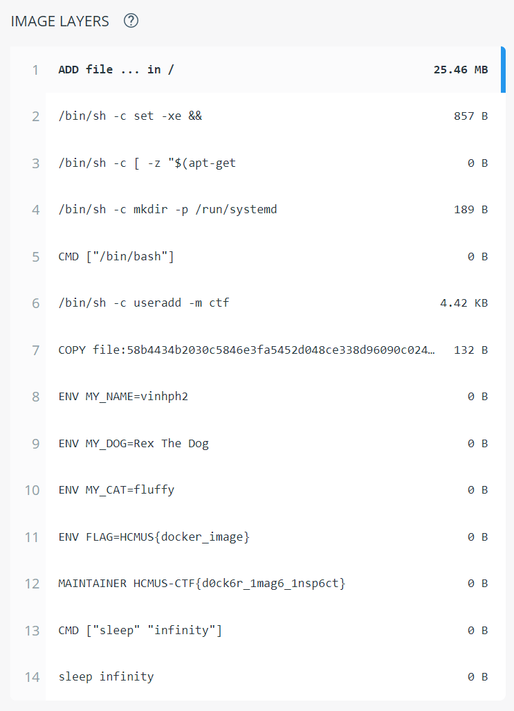

## metadata (50 points)

#### Solved by hieplpvip

```
A Docker image is a file used to execute code in a Docker container. Docker images act as a set of instructions to build a Docker container, like a template.

Image: vinhph2/hcmus-ctf-2021

author: vinhph2
```

Find that image on Docker Hub and check its layers:



**Flag:** `HCMUS-CTF{d0ck6r_1mag6_1nsp6ct}`
